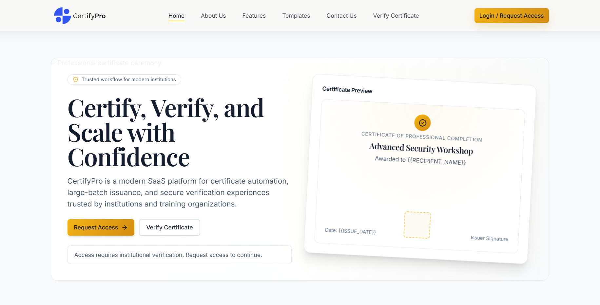
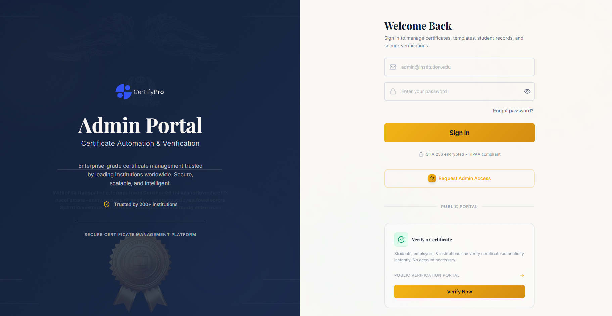
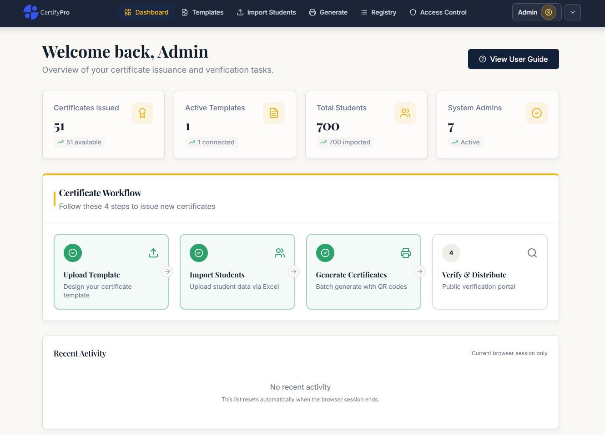
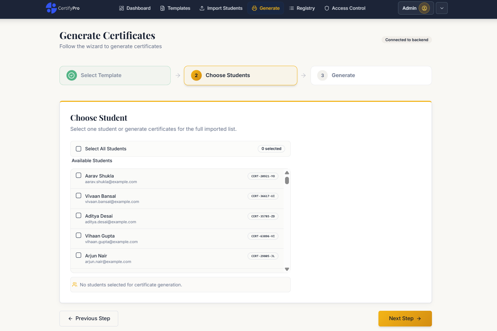
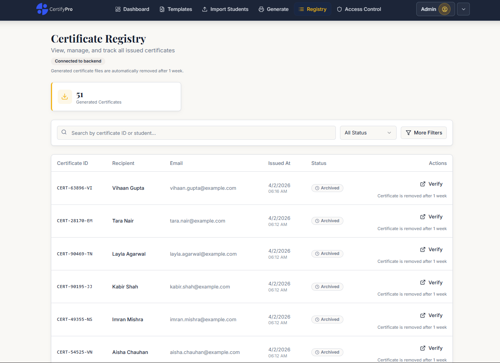
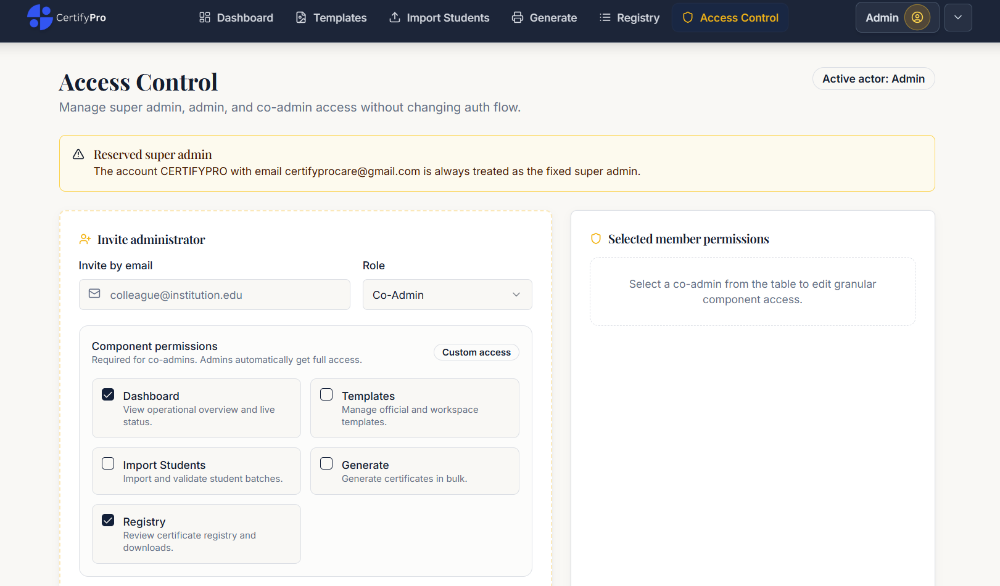
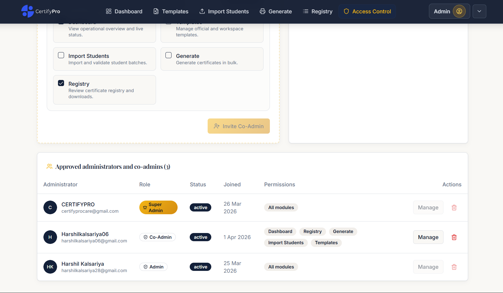
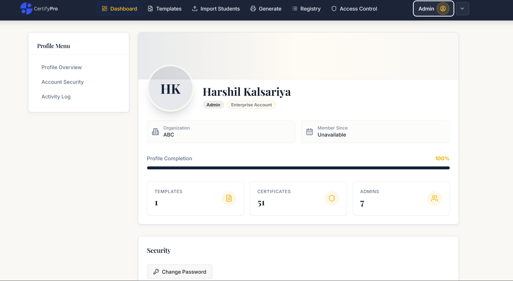
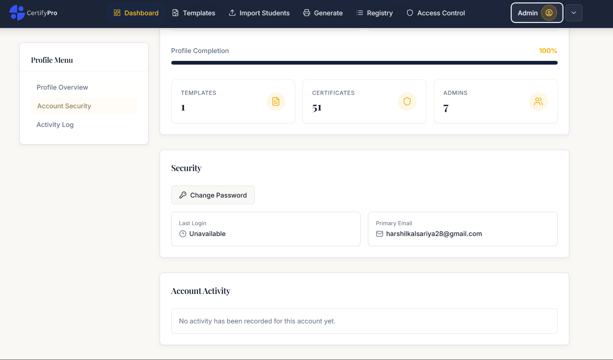
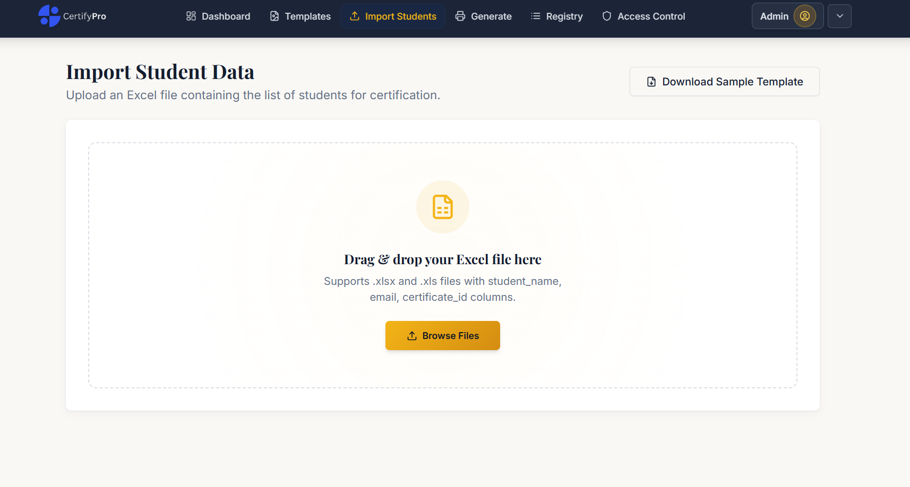

# CertifyPro — Certificate Automation & Verification Platform

CertifyPro is a full-stack certificate issuance, verification, and access-management platform for institutions, training organizations, and academic teams. It combines a React admin portal, a FastAPI backend, and Supabase for authentication, database storage, and file storage.

The repository contains the application code, schema files, and operational documentation needed to run the system locally. Because sensitive local files are intentionally excluded from source control, a ZIP download from GitHub is not enough by itself. You will need to recreate environment files and configure Supabase before the app can start successfully.

## ScreenShots 

<table>
<tr>
<td align="center">
Landing page<br/>

</td>

<td align="center">
Login/Request_Access Page<br/>

</td>
</tr>
</table>

<table>
<tr>
<td align="center">
Dashboard<br/>

</td>

<td align="center">
Main Generation Flow<br/>

</td>
</tr>
</table>

<table>
<tr>
<td align="center">
Registry<br/>

</td>

<td align="center">
Access Control<br/>

</td>
</tr>
</table>

<table>
<tr>
<td align="center">
Cont. Access Control<br/>

</td>

<td align="center">
Profile Page (Bulding..)<br/>

</td>
</tr>
</table>

<table>
<tr>
<td align="center">
Profile_page (building)<br/>

</td>

<td align="center">
Import Data<br/>

</td>
</tr>
</table>

## Overview

CertifyPro is built to support the end-to-end certificate workflow:

- organization onboarding and admin access control
- certificate template upload and workspace configuration
- student import and batch preparation
- certificate generation with QR-backed verification
- public certificate verification
- profile management and dashboard analytics
- contact and support workflows

## Architecture

The project is organized as three main layers:

- Frontend: React 18, Vite, TypeScript, Tailwind CSS, shadcn/ui, Supabase browser auth
- Backend: FastAPI, Python, Supabase Python SDK, image generation, file upload endpoints
- Platform services: Supabase Auth, Postgres, Storage, and an optional Edge Function for access-request automation

## Key Features

- Supabase-backed authentication and profile onboarding
- role-aware admin and co-admin access control
- template management with workspace layout configuration
- CSV and Excel-driven student import flows
- certificate rendering with Pillow and QR code generation
- public verification flows backed by certificate identifiers
- dashboard metrics and activity views
- contact workflow with SMTP integration

## Repository Structure

- [backend](d:/SGP/backend): FastAPI application, services, API routes, schema files, and uploads
- [frontend](d:/SGP/frontend): React application and UI assets
- [database](d:/SGP/database): additional SQL for profiles and authentication-related setup
- [supabase/functions](d:/SGP/supabase/functions): optional Supabase Edge Function for access-request processing
- [Guide.md](d:/SGP/Guide.md): step-by-step local setup guide for ZIP downloads and missing ignored files

## Prerequisites

Install these before starting local development:

- Node.js 20+
- npm 10+ or Bun
- Python 3.11+
- a Supabase project

Recommended:

- VS Code
- Git
- Supabase CLI

Optional for PDF template preview generation:

- `pdf2image`
- Poppler available on your system `PATH`

## Quick Start

### 1. Clone or extract the project

Place the project anywhere on your machine, for example `D:\SGP`.

### 2. Install frontend dependencies

```powershell
cd frontend
npm install
```

### 3. Create and activate a Python virtual environment

From the repository root:

```powershell
py -3.11 -m venv .venv
.\.venv\Scripts\Activate.ps1
python -m pip install --upgrade pip
pip install -r requirements.txt
```

### 4. Create missing environment files

Create these files manually:

- `backend/.env`
- `frontend/.env`

Minimum frontend values:

```env
VITE_SUPABASE_URL=https://YOUR_PROJECT.supabase.co
VITE_SUPABASE_ANON_KEY=YOUR_SUPABASE_ANON_KEY
```

Minimum backend values:

```env
SUPABASE_URL=https://YOUR_PROJECT.supabase.co
SUPABASE_SERVICE_ROLE_KEY=YOUR_SUPABASE_SERVICE_ROLE_KEY
FRONTEND_ORIGINS=http://localhost:5173
ACCESS_INVITE_REDIRECT_URL=http://localhost:5173/reset-password?type=invite
SMTP_HOST=smtp.yourprovider.com
SMTP_PORT=587
SMTP_USER=your-smtp-user
SMTP_PASSWORD=your-smtp-password
SMTP_FROM_EMAIL=no-reply@yourdomain.com
CONTACT_DESTINATION_EMAIL=certifyprocare@gmail.com
CONTACT_BRAND_NAME=ElevateX
```

### 5. Configure Supabase

You need these values from Supabase Project Settings:

- project URL
- anon key
- service role key

Run the SQL setup in this order:

1. [backend/database/supabase_schema.sql](d:/SGP/backend/database/supabase_schema.sql)
2. [database/profiles_schema.sql](d:/SGP/database/profiles_schema.sql)
3. [database/authentication_details.sql](d:/SGP/database/authentication_details.sql)

Create the required storage bucket:

- `certificate-templates` as a public bucket

For the full access-control model, also follow [ACCESS_CONTROL_SETUP.md](d:/SGP/ACCESS_CONTROL_SETUP.md).

### 6. Start the backend

From the repository root:

```powershell
.\.venv\Scripts\Activate.ps1
uvicorn backend.app.main:app --reload --host 0.0.0.0 --port 8000
```

Backend base URL:

```text
http://127.0.0.1:8000
```

### 7. Start the frontend

Open a second terminal:

```powershell
cd frontend
npm run dev
```

Frontend URL:

```text
http://localhost:5173
```

## Important Local Setup Notes

- ZIP downloads do not include `.env`, `.venv`, `node_modules`, or other ignored local files.
- The backend will fail fast if `SUPABASE_URL` or `SUPABASE_SERVICE_ROLE_KEY` is missing.
- Template uploads require the `certificate-templates` Supabase storage bucket to exist and be public.
- Some frontend API calls are currently hardcoded to `http://127.0.0.1:8000`, so local backend startup should use that host and port.
- PDF template preview support is optional and depends on `pdf2image` plus Poppler.

## Environment Variables

### Frontend

- `VITE_SUPABASE_URL`
- `VITE_SUPABASE_ANON_KEY`

### Backend

- `SUPABASE_URL`
- `SUPABASE_SERVICE_ROLE_KEY`
- `FRONTEND_ORIGINS`
- `ACCESS_INVITE_REDIRECT_URL`
- `SMTP_HOST`
- `SMTP_PORT`
- `SMTP_USER`
- `SMTP_PASSWORD`
- `SMTP_FROM_EMAIL`
- `CONTACT_DESTINATION_EMAIL`
- `CONTACT_BRAND_NAME`

## Available Commands

### Frontend

```powershell
cd frontend
npm run dev
npm run build
npm run lint
npm run test
```

### Backend

```powershell
.\.venv\Scripts\Activate.ps1
uvicorn backend.app.main:app --reload --host 0.0.0.0 --port 8000
```

## Additional Documentation

Use these documents depending on what you need to set up:

- [Guide.md](d:/SGP/Guide.md): full installation guide for ZIP-based setup
- [ACCESS_CONTROL_SETUP.md](d:/SGP/ACCESS_CONTROL_SETUP.md): access-control schema and backfill steps
- [DEPLOYMENT_CHECKLIST.md](d:/SGP/DEPLOYMENT_CHECKLIST.md): deployment readiness checklist
- [IMPLEMENTATION_DETAILS.md](d:/SGP/IMPLEMENTATION_DETAILS.md): implementation notes
- [PROFILES_SYSTEM_IMPLEMENTATION.md](d:/SGP/PROFILES_SYSTEM_IMPLEMENTATION.md): profile subsystem details

## Current Status

The repository contains working frontend and backend code for the core certificate workflow, but the application is environment-dependent. A fresh machine needs Supabase configuration, environment files, and package installation before the project can run.

## Team

Developed by Team ElevateX.

## License

No explicit production license is defined in this repository at the moment. Confirm licensing terms before external distribution or commercial deployment.
